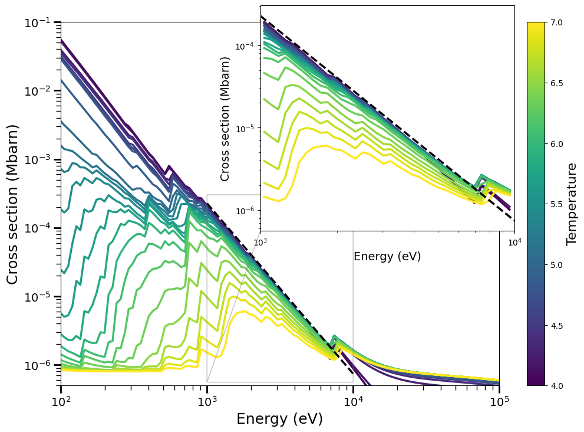

# X-ray cross section notebook
A jupyter notebook for computing the X-ray photoabsorption cross sections from 0.1 keV to 100 keV. The code uses the atomic cross section analytic fits from [Verner+1995](https://ui.adsabs.harvard.edu/abs/1995A%26AS..109..125V/abstract) for photoionization and the Klein-Nishin formula for the Compton effect from [Longair+2011](https://ui.adsabs.harvard.edu/abs/2011hea..book.....L/abstract). 

This script uses numpy, matplotlib, scipy and [ChiantiPy](https://github.com/chianti-atomic/ChiantiPy/). ChiantiPy uses the data from the [Chianti](http://www.chiantidatabase.org) atomic database. Follow the instructions [here](https://github.com/chianti-atomic/ChiantiPy/) to install this library.

## Input Files
The Verner+1995 data is in the associated .tsv file - this should not be touched! From the [ViZieR data](https://ui.adsabs.harvard.edu/abs/1994yCat..41090125V/abstract)

The only other necessary file for the script to run is the abundance file (.abund). If this is changed, just change the line in the jupyter notebook and re-run. The abundance file needs, at least, all elements that will be used in the cross section calculation, although it can have more elements. All "#" characters will be skipped. Left column: element number. Middle column: element abbreviation. Right column: abundance, relative to solar, defined as log [X/H] = log10(eps_x) - 12 (see e.g., the [Asplund+2009](https://ui.adsabs.harvard.edu/abs/2009ARA%26A..47..481A/abstract) review). The provided file comes from the Chianti database using the results of [Lodders+2009](https://ui.adsabs.harvard.edu/abs/2009LanB...4B..712L/abstract)

## Output files
It produces several PDF plots of the cross sections to show the total and elemental contributions. It also produces a data file, xdr_xsecData.dat. This column has the format of
Ntemp Nenergy
(Temperature array)
(Energy array)
(Cross section data: Ntemp rows, Nenergy columns)

This file is read and stored in XrayCommonMain and must be in the runtime directory. 

It also produces a file, for the selected temperature, of the cross section at a specified temperature (xsec_select.dat). This can be used for plotting purposes, etc.

## Example Image Output
Here is an example for a protosolar abundance:

